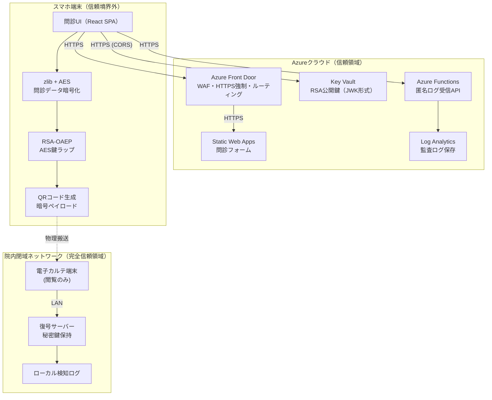

# QR問診システム – ネットワーク構成詳細

## 1. 本ドキュメントの目的

本書は **QR 問診システム** におけるネットワーク構成、信頼境界、および通信フローを技術担当者向けに説明する。インフラ設計・ファイアウォール設計・監査証跡設計の判断材料とすることを目的とする。

---

## 2. 全体構成図

---

## 3. 通信フロー詳細（番号対応）

| #  | ノード名             | 呼び出し主体          | プロトコル／ポート         | 主な役割                     | 備考                  |
| -- | ---------------- | --------------- | ----------------- | ------------------------ | ------------------- |
| 1  | Azure Front Door | スマホ端末           | HTTPS :443        | HTTPS 強制／WAF／経路制御        | フォーム・API の入口        |
| 2  | Static Web Apps  | スマホ端末           | HTTPS :443        | フロントエンド SPA 配信           | React 製問診フォーム       |
| 3  | Key Vault        | スマホ端末           | HTTPS :443 (CORS) | 公開鍵 (JWK) 配布             | **kid 固定**＋証明書ピンニング |
| 4  | Azure Functions  | スマホ端末           | HTTPS :443        | 匿名ログ受信 API               | 非機微ログのみ             |
| 5  | Log Analytics    | Azure Functions | TLS 1.2+          | 監査ログ保存                   | —                   |
| 6  | 問診 UI            | ユーザー            | ブラウザ              | 操作用 SPA                  | —                   |
| 7  | 暗号処理             | ブラウザ            | —                 | zlib 圧縮 + AES‑256‑GCM    | —                   |
| 8  | AES 鍵ラップ         | ブラウザ            | —                 | RSA‑OAEP で AES セッション鍵ラップ | 公開鍵は #3 で取得         |
| 9  | QR コード生成         | ブラウザ            | —                 | 暗号ペイロードを QR へ            | 署名非搭載               |
| 10 | 復号サーバー           | 電子カルテ端末         | LAN               | 秘密鍵で復号／ハッシュ計算            | —                   |
| 11 | 電子カルテ端末          | 医療職員            | LAN               | 問診内容表示                   | 手動転記                |
| 12 | ローカル検知ログ         | 復号サーバー          | —                 | エラー／改ざん検知ログ              | SHA‑256 ハッシュ保管      |

---

## 4. 信頼境界とセキュリティ要件

### 4.1 信頼境界（Trust Boundary）

- **スマホ端末**は境界を跨ぐ存在。端末マルウェアによる公開鍵差し替え対策として、`kid` 固定と証明書ピンニングを適用する。
- **クラウド領域**は Azure PaaS の責任範囲で TLS・認証・アクセス制御が担保される。Front Door と Key Vault を *トラストアンカー* とし、Functions／Log Analytics は **非機微ログ** 限定で利用する。
- **院内閉域ネットワーク**は完全信頼領域。秘密鍵は復号サーバーにのみ格納し、外部転送を行わない。

### 4.2 通信のセキュリティ要件

- すべての外部通信は HTTPS (TLS 1.2 以上) を強制。
- 公開鍵は Key Vault から直接取得し、中継 API を設けない。レスポンス署名の代わりに証明書ピンニングで完全性を確保。
- **Personally Identifiable Information (PII)** はクラウド経由で送信しない。
- QR 搬送時は封筒封印・患者本人搬送などの物理セキュリティに依存。

---

## 5. ログ設計

| ログ種別         | 保存先           | 保持期間 | 主キー                     | 目的             |
| ------------ | ------------- | ---- | ----------------------- | -------------- |
| アクセス匿名ログ     | Log Analytics | 30 日 | timestamp / userAgent   | 負荷分析・Bot 検知    |
| 署名なし問診ハッシュログ | 復号サーバー (RLOG) | 5 年  | RecordID / SHA‑256 ハッシュ | 改ざん追跡・トレーサビリティ |
| 監査メトリクス      | Azure Monitor | 1 年  | FunctionName            | SLA／コスト監視      |

> **備考:** IP アドレス収集の有無は PIA (Privacy Impact Assessment) の結果で決定する。現時点では保存しない方針。

---

## 6. 署名ポリシー

- QR データに RSA 署名は含めない。容量逼迫とスマホ演算負荷を回避。
- 完全性保証は復号サーバーが生成する **SHA‑256 ハッシュ** と RecordID の対応ログにより後追い可能とする。
- QR 搬送以外のチャネルを追加する場合は署名付き JSON (JWS) 設計を別途検討。

---

## 7. 今後の検討事項

1. IP アドレスを含むアクセスログ保存有無の最終決定
2. ブラウザ側公開鍵ピンニング方式 (Subresource Integrity vs DANE) の選定
3. RLOG のバックアップ／暗号化保管ポリシー

---

*最終更新 2025‑07‑09*
