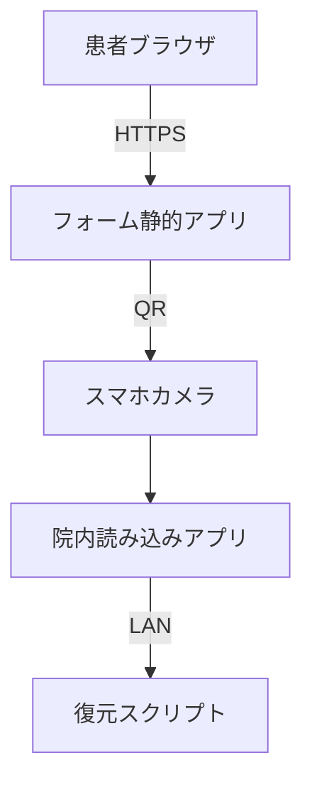

# 🗺️ マップ作成ガイド（Map‑of‑Maps）

> **目的:** 新しい **QR 問診システム** リポジトリ（ルートフォルダ ``）で迷子にならないよう、“ドキュメントを作るための地図” を示します。
>
> **対象読者:** あなた（プロジェクトリーダー）。今後参加するメンバーとも共有可能です。

---

## 0. 前提ルール

| 記号                | 意味                     |
| ----------------- | ---------------------- |
| **📁** (`FOLDER`) | 作成・参照すべきフォルダ           |
| **📄** (`FILE`)   | 作成・編集すべき Markdown ファイル |
| **✅** (`CHECK`)   | チェックリスト項目              |

> **Tip:** 本ガイドを常に開き、“北極星” として進捗を確認してください。

---

## 1️⃣ スプリント 0 チェックリスト ― リポジトリ骨格（約 1 時間）

| 手順 | アクション                                                      | 成果物      |
| -- | ---------------------------------------------------------- | -------- |
| 1  | **📁 QR\_monsin\_system/** を Git 初期化                       | リポジトリルート |
| 2  | **📁 docs/**・**📁 src/**・**📁 tests/**・**📁 specs/** を作成   | 空ディレクトリ  |
| 3  | **📄 docs/00\_overview/architecture.md** に下記 Mermaid 雛形を貼る | 高レベル構成図  |
| 4  | **📄 .github/workflows/docs-ci.yml** など、最低限の CI 雛形を置く      | CI が緑 ✔️ |
| 5  | コミット: `feat(skeleton): add project scaffolding`            | 初回コミット   |



---

## 2️⃣ ドキュメントマップ執筆手順（約 2 日）

### 2.1 *マップコンテナ* を作る

1. **📄 docs/00\_overview/README.md**
   - 目的・スコープ・凡例リンクを記載
2. **📁 docs/10\_network/** – ネットワーク層ドキュメント格納場所
   - **📄 network\_detail.md**（Tech only）
3. **📁 docs/20\_app/** – アプリ層ドキュメント
   - **📄 forms\_detail.md**・**📄 reader\_detail.md**（Tech only）
4. **📁 docs/30\_governance/** – リスク・ポリシー・RACI 等

### 2.2 各コンテナを 3 パスで埋める

| パス                | フォーカス            | 最低限入れる内容         |
| ----------------- | ---------------- | ---------------- |
| **P1 Skeleton**   | 見出し＋ TODO コメント   | `# TODO` のみでも OK |
| **P2 Tech First** | 図・API・データフロー     | TODO をほぼ解消       |
| **P3 Governance** | STRIDE / RFC 対応表 | 技術ドキュメントと相互参照リンク |

> **ポイント:** *P1 を早期にマージ* → 後続 PR で細かく更新し、レビュー負荷を減らす。

---

## 3️⃣ Unit‑First 開発モデル

1. `tests/common/` に **失敗するテスト** を書く。
2. AI へ「テストを通過する実装」を依頼。
3. グリーンになるまでループ。
4. その後で forms\_app / reader\_app に組み込み。

これで **機能単体の契約** が先に固まり、結合時の差異を最小化できます。

---

## 4️⃣ CI / ドキュメント運用のヒント

- 図は Mermaid で描き、CI で PNG などを自動生成して PR でプレビューする。
- Tech ドキュメントとコードを同じ PR で更新するルールを徹底し、「ドキュメントの腐敗」を防止。
- Governance ドキュメントは変更頻度を抑え、レビュー時に技術側への影響を確認する。

---

## 5️⃣ 道に迷ったら…

1. **このファイル** を開き、現在のチェック項目を確認。
2. 現実に合わない場合は **まず本ガイドを更新** し、“地図に新しい道” を追記してください。

> **ルール:** *「地図に載っていない道を見つけたら、先に地図を描き足す」*。

---

### 付録 – 空テンプレート集

````md
# 全体構成図

## 図

```mermaid
...
```

## 補足説明

* ここに概要を記載

````

```bash
# 例: crypto ユーティリティのテスト実行
npm run test -- tests/common/crypto.test.ts
```

---

### コマンドメモ

```bash
# docs 生成（Mermaid → PNG など）
npm run docs:build
```